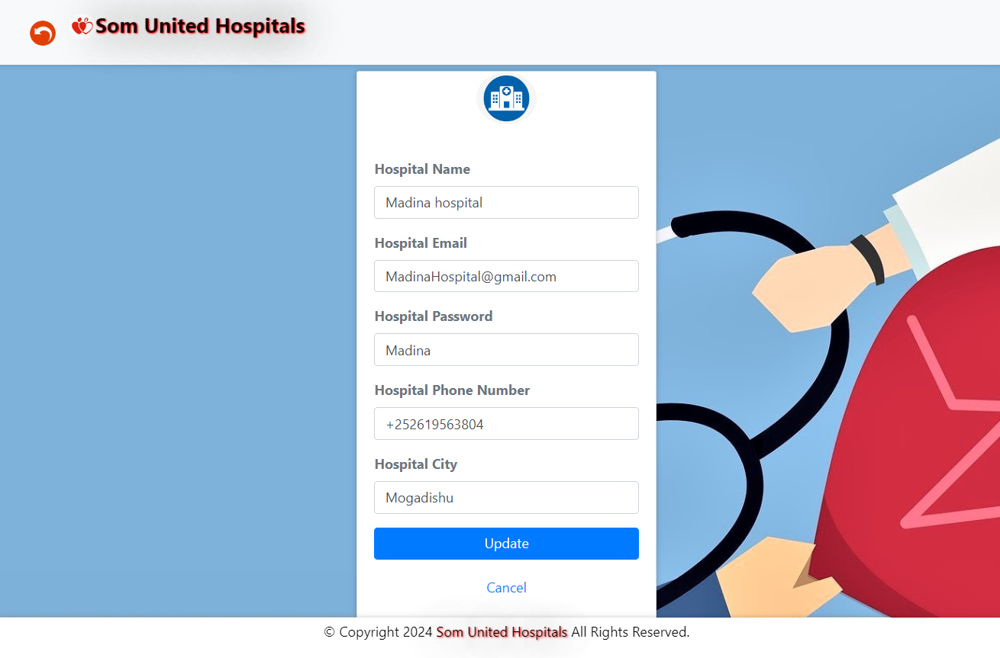
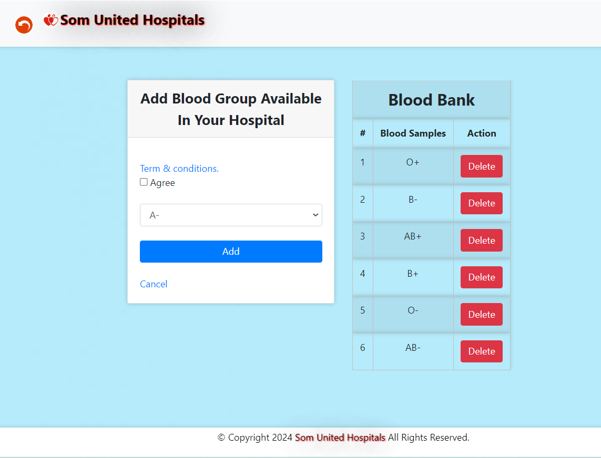
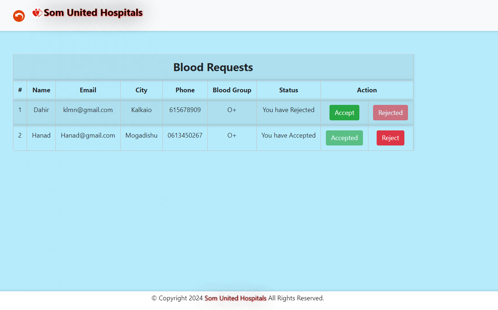
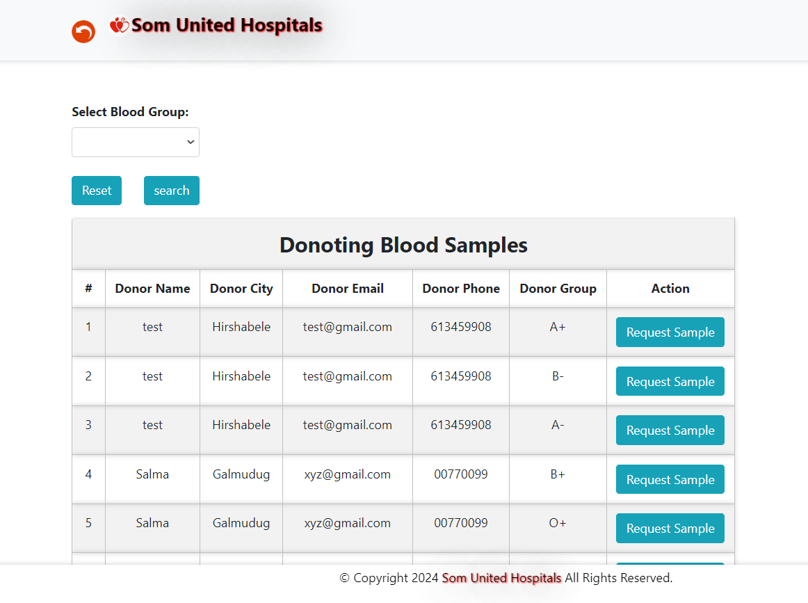
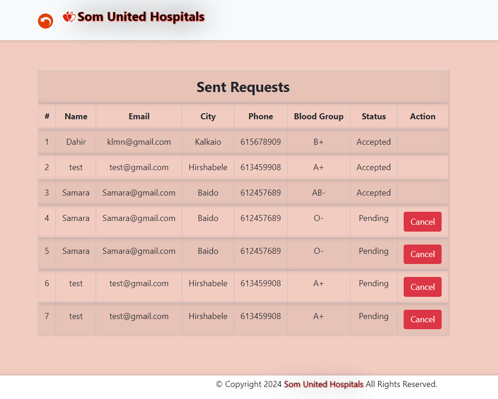

# Som-Hospitals-Blood

This project is a web application developed for managing blood-related activities in hospitals.

## Installation

1. Clone the repository: git clone https://github.com/your/repository.git
2. Configure your web server (e.g., Apache) to serve the project's files.
3. Import the database: 
   - Create a new MySQL bloodbank.
   - Import the database schema from the bloodbank.sql C:\xampp\htdocs\Som-Hospitals-Blood.
4. Configure the database connection:
   - Open the File and  connection.php 
   - Update the database credentials (hostname, username, password, and bloodbank.sql) to match your MySQL configuration.

## Usage

### User Registration & Hospital Registration

1. Access the registration page in a web browser.
2. Choose the registration option: Hospitals or Users.
3. Fill in the required information in the registration form.
4. Click the "Register" button to create an account

### Hospital Login

1. Access the hospital login page through your web browser.
2. Enter the registered email and password.
3. Click on the "Login" button.
4. If the credentials are correct, you will be redirected to the hospital's dashboard.

### User Login

1. Access the user login page through your web browser.
2. Enter the registered email and password.
3. Click on the "Login" button.
4. If the credentials are valid, you will be redirected to the user's dashboard.

### Hospital Dashboard

The hospital dashboard provides the following functionalities:

- **My Account**: Allows the hospital to view and update their account information.

- **Stock of Blood**: Displays the current stock of blood available in the hospital, categorized by blood type.

- **Blood Requests**: Shows a list of blood requests made by users, including the requested blood type and status.

- **Need Blood**: Allows the hospital to submit a request for blood, specifying the required blood type and quantity.

- **Status of Your Blood Request**: Displays the status (e.g., pending, fulfilled) of the hospital's blood requests.

## Contributing

Contributions to this project are welcome. If you find any issues or have suggestions for improvements, please open an issue or submit a pull request on the project's GitHub repository.

## License

This project is licensed under the [MIT License](LICENSE).

## Contact

For any inquiries or support regarding this project, please contact the project maintainer:

- Name: Hanad Olad Bade
- Email: HanadO.bade@gmail.com

